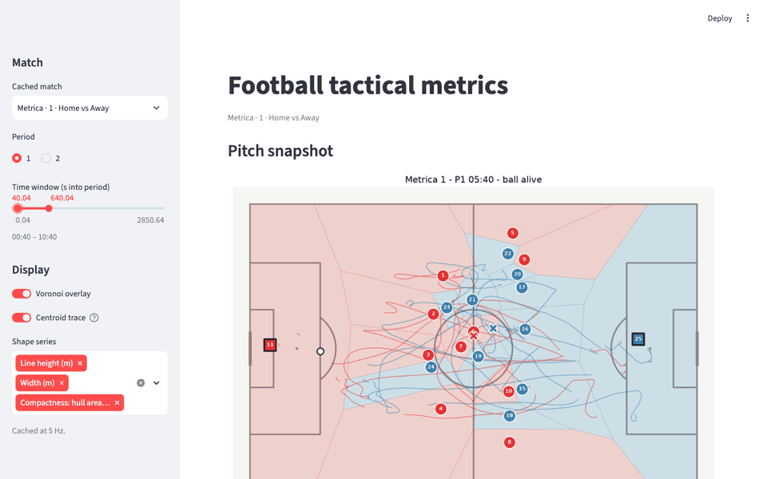
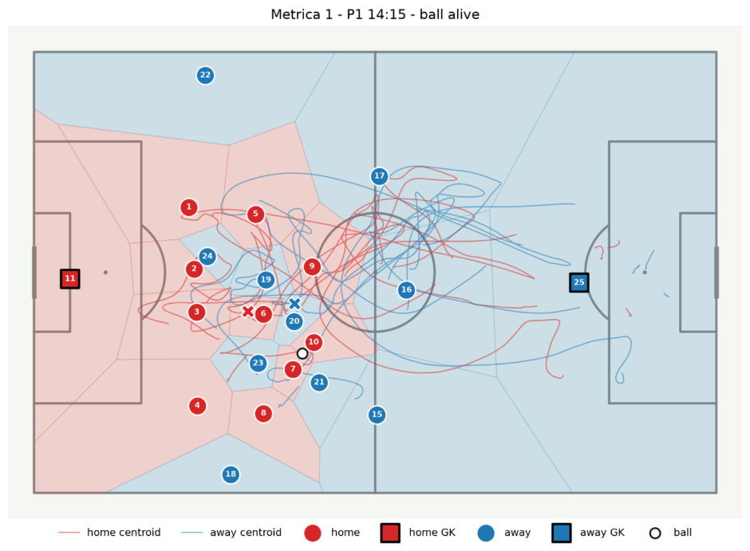
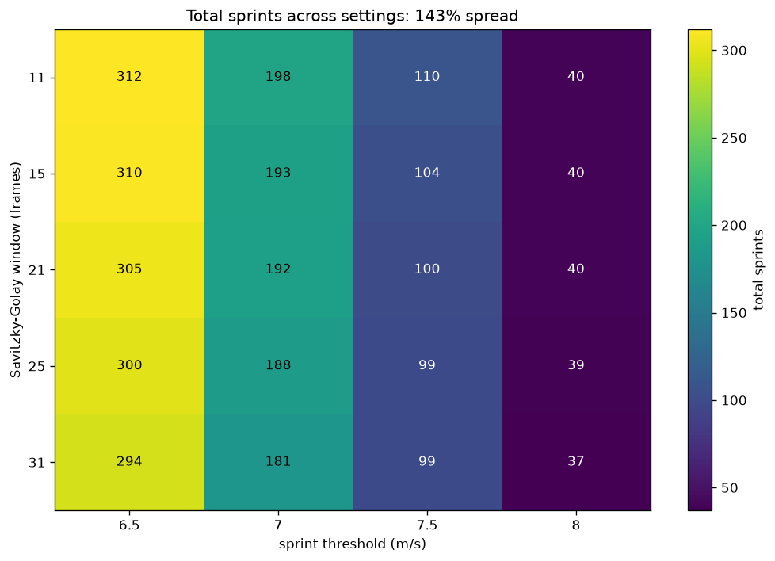
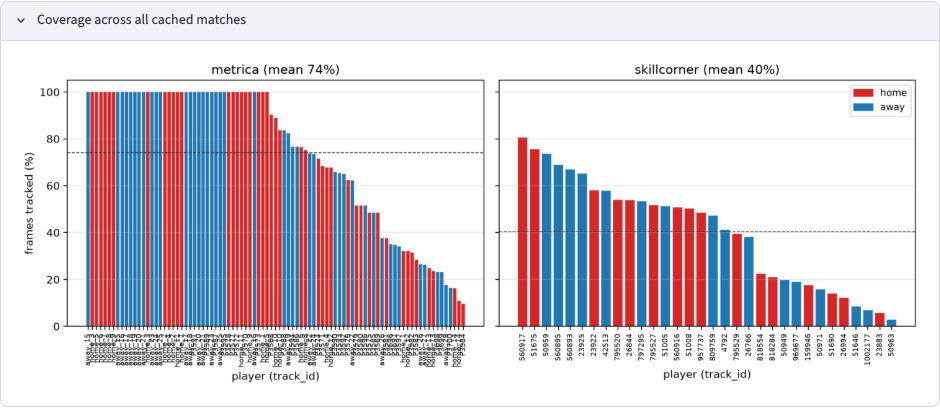
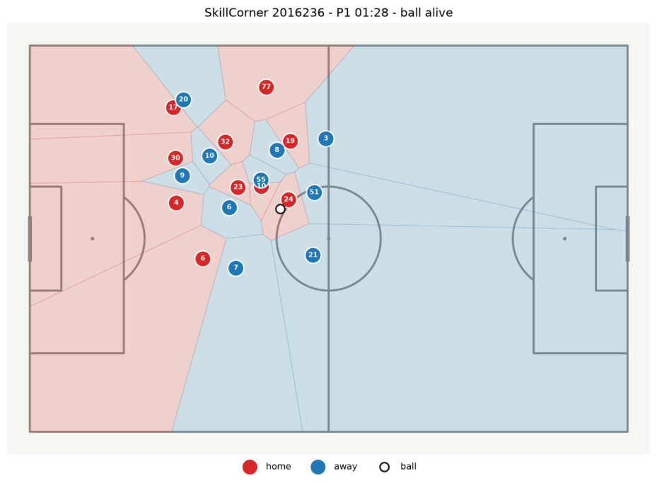
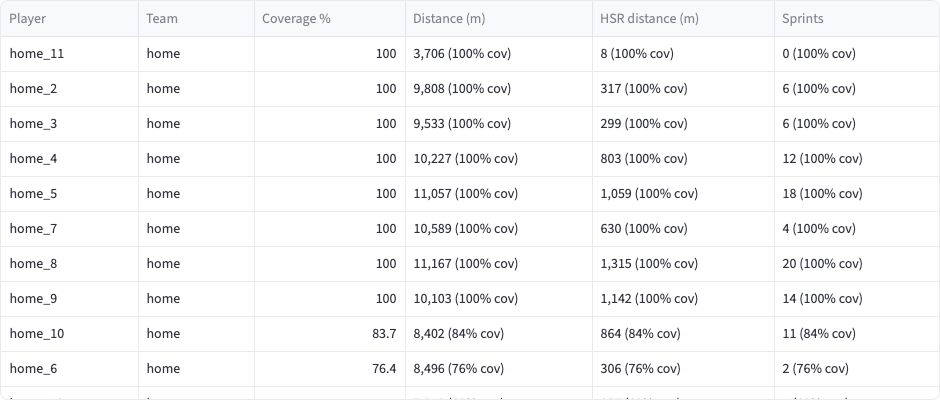

# Football Tactical Metrics (B1)

Player-tracking data in, validated tactical and physical metrics out.

Tracking data is the x/y position of every player and the ball, 10–25 times a
second, for a whole match. This project turns it into numbers a coach or
analyst would use (how high a team defends, how much space it controls, how
far and how fast each player ran), checks those numbers against known answers,
and shows how much they move when the settings change.

Two data providers go through **one schema** and **one metrics layer**. The
metrics code never knows which provider a frame came from: even whether a
player's distance is reported is decided by how much of the match they were
tracked, not by where the data came from.



**No hosted demo, on purpose.** The dashboard only views precomputed files;
there's no model or live computation behind it, so the recording above and the
[run-it-locally](#running-it-locally) steps show everything a link would. A
hosted copy would also need the cache online, and the cache holds Metrica's
player positions (thinned to 5 per second), which would redistribute data this
repo promises not to (see §7).

---

## 1 · Snapshot



*Metrica match 1, first half, 14:15. Each dot is a player (red = home,
blue = away, square = goalkeeper, open circle = ball). Each shaded cell is the
part of the pitch closer to that player than to anyone else (a Voronoi
diagram), so the red area is the space the home team controls at this moment.
The thin lines trace each team's centroid (average position) over the
selected 09:30–19:00 window, broken at stoppages; the X marks it at this frame.*

## 2 · Metrics

Every threshold lives in [`configs/metrics.yaml`](configs/metrics.yaml) and
nowhere else.

| Metric | Plain meaning | Definition | Threshold(s) |
|---|---|---|---|
| Defensive line height | How far up the pitch the defence stands | Mean `x` of the 4 deepest outfield players, in the team's own attacking direction (negative = near own goal) | 4 players |
| Width / Length | How spread out the team is | `max − min` of outfield `y` / `x` | — |
| Compactness | How tight the team is | Convex-hull area (m²) of outfield players | — |
| Centroid | Where the team is, on average | Mean (`x`, `y`) of outfield players; drawn on the pitch as a path over the time window | — |
| Space control | How much pitch each team "owns" | Voronoi cell area per player, clipped to the 105 × 68 m pitch, goalkeepers included | — |
| Pressing | How many opponents are closing down the ball | Opponents within 5 m of the ball carrier (carrier = player within 3 m of the ball) | 5 m / 3 m |
| Distance covered | How far a player ran | Sum of step distances on the smoothed track | Savitzky-Golay window 21 frames (0.84 s at 25 Hz), order 2 |
| High-speed running (HSR) | Distance run fast | Distance at ≥ 5.5 m/s (19.8 km/h), sprints included | 5.5 m/s |
| Sprints | Number of all-out efforts | ≥ 1 s continuously above 7.0 m/s (25.2 km/h); dips shorter than 1 s are merged into the same sprint | 7.0 m/s / 1 s / 1 s |

Shape and space metrics are computed only while the ball is in play. Frames
where a team has fewer than 8 visible outfield players are **flagged, not
dropped** (this happens with broadcast data).

**Coverage rule.** Distance, HSR and sprints are reported only for players
tracked in **at least 95% of the match's frames** (`physical.min_coverage_pct`).
Below that, a total is an undercount that looks like a real number, whether
the gaps come from a TV camera looking elsewhere, a substitution or any future
tracking source. Those players keep their row, with the values left empty and
a `below_coverage` flag.

**How speed is computed.** Positions are smoothed with a Savitzky-Golay filter
and then differentiated, at the provider's native frame rate. Before
smoothing, any frame-to-frame jump faster than 12 m/s is treated as a tracking
glitch. The track is split at that point and a one-frame spike is removed, so
the error is never smeared into the neighbouring frames. After smoothing, any
speed still above 12 m/s (43 km/h) is clipped **and counted**:

| Match | Speed samples | Glitch steps removed | Clipped at 12 m/s |
|---|---:|---:|---:|
| Metrica 1 | 3,190,138 | 434 | 4 |
| Metrica 2 | 3,105,361 | 1,073 | 4 |
| Metrica 3 | 3,162,739 | 761 | 5 |
| SkillCorner 2016236 | 474,009 | 47 | 10 |

## 3 · Validation

Full results are in [`reports/validation.json`](reports/validation.json).
**126 of 146 checks pass.** All 23 synthetic checks pass. 20 of the 123
real-data checks fail, and they are reported rather than tuned away.

**Synthetic ground truth.** These are fake trajectories where the right answer
is known exactly.

| Case | Checks | Expected | Got |
|---|---|---:|---:|
| Straight line, 5 m/s for 10 s | distance | 50.0 m | 50.0 m |
| Circle, r = 9.15 m, one lap | distance (±1%) | 57.49 m | 57.31 m |
| Standing still with noise | distance vs un-smoothed | ≈ 0 | 2.9% of raw |
| Straight line, 9.5 m/s | sprints | 1 | 1 |
| Straight line, 6.25 m/s | sprints / HSR = distance | 0 / 62.5 m | 0 / 62.5 m |
| 18 m/s (impossible) | clipped top speed | 12.0 | 12.0 |
| 5 m/s with a 5 m one-frame spike | top speed (spike rejected) | 5.0 | 5.0 |
| Flat back four at x = −30 m | line height / width / hull area | −30 / 40 / 908 | −30 / 40 / 908 |
| Voronoi, 22 players | total area / home share | 7140 m² / 0.5 | 7140 m² / 0.5 |
| Unknown provider "track_a", tracked 40% of the time | physical metrics refused | refused | refused |
| Same match, fully tracked player | distance reported | 50.0 m | 50.0 m |

**Physiological ranges.** These cover players who played the full match
(present in the first and last frame of every period) across the 3 Metrica
matches.

| Check | Expected band | Players | Pass | Median | Range |
|---|---|---:|---:|---:|---|
| Total distance | 9–12 km | 37 | 35 | 10.27 km | 9.21–12.53 |
| Top speed (outfield) | 8–11 m/s | 37 | 32 | 9.06 m/s | 7.92–12.00 |
| HSR share of distance | 5–15% | 37 | 25 | 6.27% | 2.33–11.77 |
| Top speed (goalkeeper) | ≤ 11 m/s | 6 | 5 | 6.60 m/s | 5.38–11.97 |
| Team compactness (median hull) | 300–1500 m² | 6 | 6 | 929 m² | 862–1032 |

What the failures mean:
- **HSR share (12 fail):** most are centre-backs, who run fast less than other
  positions, in a low-intensity match. Computing HSR from the raw, unsmoothed
  data gives the same median (6.6%), so the pipeline is not causing it. The
  band comes from Gualtieri et al. 2023, whose study means work out to about
  8–14%.
- **Top speed (5 fail):** 2 players hit the 12 m/s clip ceiling, which means a
  tracking error survived glitch rejection. 2 are just under 8 m/s. 1 is
  11.2 m/s.
- **Distance (2 fail):** 12.1 and 12.5 km, both box-to-box midfielders in
  Metrica 3. That match runs faster for everyone (119 m/min against 109 in the
  other two), even under 5 s of smoothing, so it's real movement, not noise.
  Raw and smoothed distance differ by only about 1%.
- **Goalkeeper (1 fail):** 11.97 m/s, almost certainly a tracking slide just
  under the glitch threshold.

## 4 · Sensitivity: the honest result

> **Smoothing barely matters: across every smoothing window tested, sprint
> count moves 9% and distance 1%. The sprint speed threshold moves it 138%.**
> So when two sources disagree on sprint numbers, the disagreement comes from
> how a sprint is *defined*, not how speed is *computed*, which is why I
> report the definition alongside the number. (Across the whole grid the
> spread is 143%.)



*Total sprints in Metrica match 1 (all 28 tracked players) for every
combination of smoothing window (11–31 frames at 25 Hz, i.e. 0.44–1.24 s) and
sprint threshold (6.5–8.0 m/s). Every cell is a setting someone could
reasonably publish. The default (21 frames, 7.0 m/s) gives 192 sprints. The
grid ranges from 37 to 312, a spread of 143% of the default.*

| What changes | Spread |
|---|---:|
| Smoothing window alone (11 → 31 frames) | 9% |
| Total distance, across windows | 1% |
| **Sprint threshold alone (6.5 → 8.0 m/s)** | **138%** |
| Both together | 143% |

The computation is robust; the definition is not. A sprint count published
without its threshold can't be compared with another. Full grid:
[`reports/sensitivity.json`](reports/sensitivity.json).

## 5 · Coverage: Metrica vs SkillCorner



| Provider | Match | Player tracks | Mean coverage | Tracks ≥ 99% |
|---|---|---:|---:|---:|
| Metrica (full-pitch) | 1 | 28 | 78.6% | 16 |
| Metrica (full-pitch) | 2 | 26 | 84.6% | 18 |
| Metrica (full-pitch) | 3 | 35 | 62.9% | 9 |
| SkillCorner (broadcast) | 2016236 | 32 | 40.4% | 0 |

Coverage is the share of the match's frames in which a player was tracked.
Metrica tracks the whole pitch, so starters are near 100% and the lower values
are mostly substitutes. SkillCorner tracks from the TV broadcast, so players
drop out whenever the camera isn't on them:



*SkillCorner, first half, 01:28. Only the 20 players in the camera's view
exist in this frame.*

**Because of this, no SkillCorner player gets distance, HSR or sprints.** Not
because the code knows it's SkillCorner, but because no broadcast track
reaches the 95% coverage rule (§2); the best-tracked player is seen about 80%
of the time. The dashboard shows "n/a (low coverage)" for them, and for Metrica
substitutes, who are below 95% for the same honest reason. Shape, space and
pressing are still computed for every match.



## 6 · The schema contract

[`src/ftm/schema.py`](src/ftm/schema.py) defines the canonical DataFrame.
`validate()` enforces it and raises on any violation.

| Column | Type | Meaning |
|---|---|---|
| `frame_id` | int64 | Frame number |
| `period` | int8 | Half (1, 2, …) |
| `timestamp` | float64 | Seconds into the period |
| `track_id` | string | Player ID (stable within a match) |
| `team` | category | `home` / `away` / `ball` |
| `jersey_number` | Int16 | Shirt number (nullable) |
| `x_pitch`, `y_pitch` | float64 | Metres from pitch centre; x along the length (±52.5), y across (±34) |
| `is_ball`, `is_gk` | bool | Row is the ball / a goalkeeper |
| `ball_state` | category | `alive` / `dead` |

Loaders ([`src/ftm/loaders/`](src/ftm/loaders/)) turn each provider's format
into this frame through [kloppy](https://kloppy.pysport.org/). Nothing under
[`src/ftm/metrics/`](src/ftm/metrics/) imports kloppy or a loader, and a test
enforces that. The frame has no provider column, and no metric takes a
provider argument: which physical numbers get reported is decided by tracking
coverage alone. A test runs a made-up provider ("track_a") through the
pipeline to prove it gets the same rule.

A future tracking pipeline built from video (Track A) that emits a DataFrame
passing `validate()` will run through every metric here unchanged. This is the
same move as `backends/base.py` in
[project A1](https://github.com/Kushagra077/football-detect-serve), one level up.

## 7 · Licensing & attribution

- **This repo:** MIT. kloppy is BSD-3, mplsoccer is MIT, scipy is BSD, and
  there's no AGPL dependency anywhere, so MIT ships cleanly. (A1 can't:
  Ultralytics is AGPL-3.0.)
- **[Metrica Sports Sample Data](https://github.com/metrica-sports/sample-data):**
  no license is stated, so it's used with attribution to Metrica Sports. The
  files are downloaded at build time and never redistributed here.
- **[SkillCorner Open Data](https://github.com/SkillCorner/opendata):** MIT.
  Credit to SkillCorner.

---

## Running it locally

Requires [uv](https://docs.astral.sh/uv/) and Python 3.13.

```bash
uv sync --extra dev --extra app

# 1. Download provider data and precompute metrics -> data/cache/*.parquet
uv run python -m scripts.build_cache --provider metrica                       # 3 matches, ~1-2 min each
uv run python -m scripts.build_cache --provider skillcorner --match-id 2016236

# 2. Regenerate reports/validation.json + reports/sensitivity.json
uv run python -m scripts.validate

# 3. Dashboard (reads only the cache)
uv run streamlit run app/streamlit_app.py

# Tests (offline, as in CI) and lint
uv run pytest -m "not integration" -q
uv run ruff check .
```

**The cache.** The dashboard never touches raw data. It reads parquet files
that `build_cache` writes once, offline. Speeds and physical metrics are
computed at the native rate (25 Hz for Metrica). Everything else is then
downsampled to **5 Hz** for the cache, which keeps 4 matches at about 180 MB.
The cache is not committed, so rebuild it with step 1. Only one of the
SkillCorner matches is cached, to stay within a few hundred MB. The loader can
read the others with `--match-id`.

**Project layout**

```
configs/metrics.yaml   every threshold
src/ftm/loaders/       provider -> canonical frame (Metrica, SkillCorner)
src/ftm/schema.py      the contract
src/ftm/kinematics.py  smoothing, speed, glitch rejection, clipping
src/ftm/metrics/       shape, space (Voronoi), pressing, physical
src/ftm/pipeline.py    load -> kinematics -> metrics -> cache
scripts/               build_cache, validate
app/                   Streamlit dashboard
reports/               committed validation + sensitivity JSON
```
